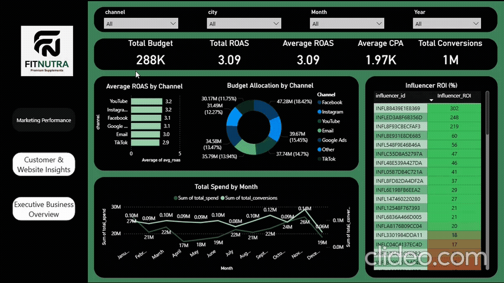

# FitNutra Marketing Optimization (Python, SQL, Power BI)

## Executive Summary

Analyzed 6 months of FitNutra sales, marketing, and website data (\~50k customers, 1M sessions) to increase whey protein & pre-workout sales by 30%, reduce CAC, and boost customer CLV. Applied Python, SQL, and Power BI to identify top-performing products, optimize marketing channels, and forecast emerging trends. Recommendations, including subscription models and vegan product launches, projected **30% sales growth** and **CAC reduction from ₹37.5K → ₹25K**.

---
## 🎥 Demo

> If the GIF doesn’t play, double-click on it to view the full animation.
---

## Business Problem

* Sales growth targets (30% in 6 months) were unmet.
* Marketing spend inefficient: Google Ads CAC high, Instagram & email underutilized.
* Customers rarely repeated purchases; CLV was low (\~₹5,000).
* Website issues: high bounce (40–45%) and cart abandonment (30–40%).
* Competitors outperformed FitNutra in social media & SEO.
* Lack of predictive insights for new products (vegan supplements, energy bars).

Why it matters: Without intervention, FitNutra risks losing market share, overspending on ineffective marketing, and missing growth opportunities in India’s fitness supplement sector.

## Methodology

* **Exploratory Data Analysis (EDA):** Product-wise sales, segment contribution, festive trends.
* **Marketing Performance Analysis:** ROAS, CAC, influencer ROI across Google Ads, Instagram, YouTube, and email.
* **Customer Segmentation & CLV Analysis:** Demographics, purchase frequency, subscription impact.
* **Website Optimization Analysis:** Bounce rates, cart abandonment, mobile UX.
* **Competitor Analysis:** Market share, SEO keywords, social media campaigns.
* **Predictive Modeling:** ARIMA forecasting for next 3–6 months’ product demand and sales trends.

**Why these methods:** Each method directly addresses FitNutra’s business challenges, enabling **data-driven recommendations for marketing, sales, and product strategy**.

## Tech Stack & Skills

* **Tools:** Python (Pandas, Matplotlib, Seaborn), SQL, Power BI, Excel
* **Techniques:** EDA, Cohort Analysis, Funnel Analysis, ARIMA Forecasting, ROI Analysis, Segmentation
* **Skills Demonstrated:** Budget optimization, CAC & ROAS calculations, CLV modeling, subscription strategy, actionable insights communication, predictive analytics

## Key Results & Recommendations

1. **Sales Growth:** Whey protein (60%) and pre-workout (25%) dominate. Muscle Gain segment in Mumbai/Delhi drives 35% of orders.
   * **Action:** Launch whey + shaker bundle (15% off) for Diwali 2025; target Muscle Gain segment via Instagram ads.

2. **Marketing Optimization:** Instagram ROAS 3.2 > Google Ads CAC ₹40K; top influencer (INF001) ROI 4.5.
   * **Action:** Shift 40% budget from Google → Instagram; double top influencer budget; pause underperforming influencer campaigns.

3. **Customer Behavior & CLV:** CLV \~₹12,760 for subscription users; repeat rate 25%.
   * **Action:** Offer 15% subscription discount + free shaker; run loyalty campaigns targeting high-value customers in Mumbai/Delhi.

4. **Website Optimization:** Mobile bounce 45%, cart abandonment 30%, checkout slow.
   * **Action:** Optimize mobile checkout <3s, add UPI/COD trust badges, test exit-intent popups.

5. **Competitor Insights:** MuscleBlaze & GNC lead via SEO & Instagram.
   * **Action:** Target 50 SEO keywords; launch TikTok challenges; collaborate with fitness blogs.

6. **Predictive Insights:** Vegan supplements demand high (80% confidence), energy bars medium (50%).
   * **Action:** Launch vegan protein in Q1 2026; pilot energy bars with influencers; forecasted 15% growth in Q2 2026.

## 📫 Connect with Me  
  

